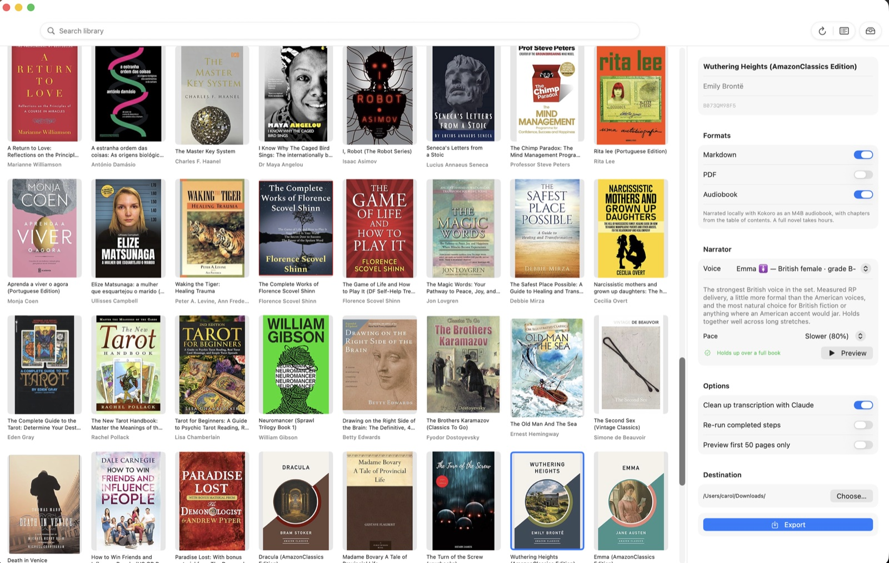

# Kindle Export

> A macOS app that exports Kindle books you own as Markdown, PDF, or a locally
> narrated M4B audiobook.

<p>
  <a href="https://github.com/crscarolina/kindle-ai-export/actions/workflows/main.yml"></a>
  <a href="./LICENSE.md"></a>
</p>

Pick a book from your Kindle library, choose what you want out of it, and walk
away. Everything runs on your own machine: pages are read with macOS's built-in
Vision OCR, and audiobooks are narrated locally. No transcription API, no
text-to-speech account, no per-book cost.

**You must own the book on Kindle for any of this to work.**

<p align="center">
  
</p>

- [Example output](#example-output)
- [How it works](#how-it-works)
- [Requirements](#requirements)
- [Getting started](#getting-started)
- [What you get](#what-you-get)
- [Audiobooks](#audiobooks)
- [Using it from the terminal](#using-it-from-the-terminal)
- [How your library is stored](#how-your-library-is-stored)
- [Limitations](#limitations)
- [Credits](#credits)

## Example output

The first 50 pages of *Wuthering Heights*, which is out of copyright, exported
by the app:

- **[Transcript](./examples/wuthering-heights/wuthering-heights-first-50-pages.md)**
  — 50 pages as Markdown with a table of contents. The cleanup pass restored
  177 paragraph breaks that OCR had flattened away.
- **[Audiobook excerpt](./examples/wuthering-heights/wuthering-heights-chapter-1.m4b)**
  — the opening chapters narrated by Kokoro's *Emma*, a British voice, as a
  chaptered M4B.

Both were produced by the pipeline described below, on the machine this was
written on, with no API key involved.

## How it works

Kindle books are DRM-protected, so the contents cannot simply be read off
disk. Instead the app drives the [Kindle web
reader](https://read.amazon.com) in your own Chrome, captures each page as an
image, and reads the text back with Vision OCR. From there it is ordinary text
and can become anything.

| Step | What happens |
| --- | --- |
| **Capture Pages** | Chrome walks the book, saving a PNG per page |
| **Read Text** | macOS Vision OCR transcribes each page locally |
| **Clean Up** | Claude repairs OCR artefacts — see below |
| **Markdown / PDF** | The text is assembled with a table of contents |
| **Audiobook** | Kokoro narrates it locally as a chaptered M4B |

The cleanup step is worth explaining. OCR reads a page as it is printed, so
sentences arrive wrapped mid-line, quotation marks go missing, and `I'd` comes
back as `l'd`. Claude rejoins the paragraphs and repairs those artefacts
without rewriting the prose. It runs through the `claude` CLI, using your
existing subscription rather than a metered API key, and a safety check keeps
the original text for any passage that comes back materially shorter than it
went in.

## Requirements

- **macOS 14 or later**
- **Google Chrome** — the extractor drives your installed copy
- **Node 20+** and [pnpm](https://pnpm.io)
- **[Claude Code](https://claude.com/claude-code)**, signed in, for the cleanup
  step
- **ffmpeg** (`brew install ffmpeg`) for audiobooks
- An Amazon account with books in it

Xcode is *not* required. The app builds with the Command Line Tools.

## Getting started

```sh
git clone https://github.com/crscarolina/kindle-ai-export.git
cd kindle-ai-export
pnpm install

cd app
./build-app.sh debug && open build/KindleExport.app
```

Then, in the app:

1. Open **Settings (⌘,)** and enter your Amazon email and password. The
   password is stored in your Keychain and handed to the exporter as an
   environment variable, never on a command line.
2. Click **Sign In to Amazon**. Chrome opens visibly so you can complete
   sign-in and two-factor by hand, once. Every export afterwards reuses that
   session unattended.
3. Click **Refresh** to load your library.
4. Pick a book, choose your formats, and press **Export**.

Exports run one at a time — Chrome takes an exclusive lock on the shared
profile — and the queue is visible from the toolbar. A finished export posts a
system notification, because a full book takes a while.

### Build modes

`./build-app.sh debug` symlinks the pipeline into the app, so edits to `src/`
take effect without rebuilding. `./build-app.sh release` copies it in, making
the app self-contained at the cost of size.

## What you get

Files are named for the shelf they would sit on:

```
Marillier,_Juliet_-_Daughter_of_the_Forest_-_A_Sevenwaters_Novel_1_(B003R50A4Q).md
```

Markdown and PDF both carry the book's table of contents. The M4B carries real
chapter markers, so players can skip between chapters and remember where you
were.

## Audiobooks

Narration uses [Kokoro-82M](https://huggingface.co/hexgrad/Kokoro-82M), an
open-weights model that runs on the CPU. The model downloads once on first
use; after that narration is entirely offline and costs nothing.

**It is slow.** Expect roughly a second of compute per second of audio, so a
novel is an overnight job. Every piece of audio is cached as it is made, so an
interrupted run resumes rather than starting over.

There are **28 voices**, each with a description and Kokoro's own quality
grade, and a pace control from 80% to 125%. Only four voices are graded well
enough to carry a full-length book, and the picker says which. Audition clips
can be rendered in advance:

```sh
npx tsx src/render-voice-previews.ts --voice af_heart,af_bella
npx tsx src/render-voice-previews.ts --speed all   # every voice, every pace
```

## Using it from the terminal

The app is a front end over scripts that work on their own. Each takes flags,
falling back to environment variables:

| Flag | Meaning |
| --- | --- |
| `--asin <asin-or-url>` | The book. A bare ASIN or a `read.amazon.com` URL. |
| `--work-dir <dir>` | Where working files live. Defaults to `./out`. |
| `--user-data-dir <dir>` | Chrome profile. Defaults to `<work-dir>/<asin>/data`. |
| `--out-file <path>` | Where to write this step's artifact. |
| `--limit <n>` | Stop after `n` pages, for previewing a book. |
| `--voice <id>` / `--speed <n>` | Narration voice and pace. |
| `--json` | Emit NDJSON progress events instead of prose. |
| `--force` | Redo work that is already complete. |

```sh
npx tsx src/list-library.ts --out-file library.json
npx tsx src/extract-kindle-book.ts --asin B0819W19WD
npx tsx src/transcribe-book-content.ts --asin B0819W19WD
npx tsx src/clean-transcription.ts --asin B0819W19WD
npx tsx src/export-book-markdown.ts --asin B0819W19WD --out-file book.md
npx tsx src/narrate-book.ts --asin B0819W19WD --out-file book.m4b
```

`src/check-pagination.ts` reports which books can be exported and how each is
indexed.

## How your library is stored

```
~/Library/Application Support/kindle-ai-export/
  session/     one shared Chrome profile — you sign in once, not per book
  <asin>/      page images, transcription, audio cache
  library.json cached library listing
  previews/    voice audition clips
```

Finished exports go wherever you choose in the app. Working files stay here, so
a book you have already captured is not captured again.

## Limitations

- **Apple Silicon is untested.** Development has been on an Intel Mac. CI
  builds on arm64, but nothing beyond the build and unit tests has been
  exercised there.
- **Not every book has page numbers.** Some editions have no print counterpart,
  and Amazon gives them Kindle locations instead. Those are handled — the
  export is indexed by location — but page-numbered books are the better-tested
  path.
- **OCR is not perfect.** Accuracy is high, but expect the occasional oddity in
  a long book.
- **Narration is slow** and pegs several cores for hours.
- Embedded images are not extracted.

## Credits

This began as a fork of
**[kindle-ai-export](https://github.com/transitive-bullshit/kindle-ai-export)**
by **[Travis Fischer](https://x.com/transitive_bs)**, whose work established
the approach this rests on: driving the Kindle web reader with Playwright,
capturing pages as images, and reconstructing the book from the reader's own
metadata. The extraction here is still recognisably his design.

What has changed since: the macOS app, local Vision OCR in place of a
multimodal API, the Claude cleanup pass, local Kokoro narration with M4B
chapters, support for books with no page numbers, and a test suite.

MIT. Copyright (c) 2024 Travis Fischer and (c) 2026 crscarolina. See
[LICENSE.md](./LICENSE.md).

## Disclaimer

For personal and educational use. Not endorsed by or affiliated with Amazon or
Kindle. Please do not share exported books — authors and artists should be paid
for their work. Owning a copy of a book is not permission to redistribute it.
